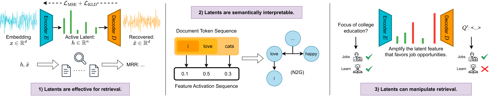

# Embedding Scope

This repository contains the official released work for the paper [Interpret and Control Dense Retrieval with Sparse Latent Features](https://arxiv.org/abs/2411.00786) to be presented at NAACL 2025.

The paper introduces a novel approach using sparse autoencoders (SAE) to interpret and control dense embeddings via learned latent sparse features. The key contribution is a retrieval-oriented contrastive loss that ensures the sparse latent features remain effective for retrieval tasks. Experimental results show that the learned latent sparse features and their reconstructed embeddings retain nearly the same retrieval accuracy as the original dense vectors, allowing for meaningful interpretation and control of retrieval behaviors.



## Quickstart

### 0. Setup the Environment

Create and activate the conda environment:

```bash
conda env create -f environment.yml
conda activate scope
```

Specify where to store the dataset and model weights inside `devconfig.env`:

```bash
export WORKSPACE=/path/to/your/workspace
export DATASET_DIR=$WORKSPACE/dataset
export WEIGHTS_DIR=$WORKSPACE/weights
```

If you do not have SLURM installed, you can run the following scripts using `bash` instead of `sbatch`. This would behave as if only one worker is available. Make sure to wait for each script to complete before submitting the next one.

### 1. Prepare the Dataset

**MS MARCO**

```bash
sbatch scripts/download_msmarco.sh  # Download MS MARCO
sbatch scripts/transform_msmarco.sh # Split into chunks
sbatch scripts/embed_msmarco.sh     # Compute embeddings
```

### 2. Train the k-Sparse Autoencoders
